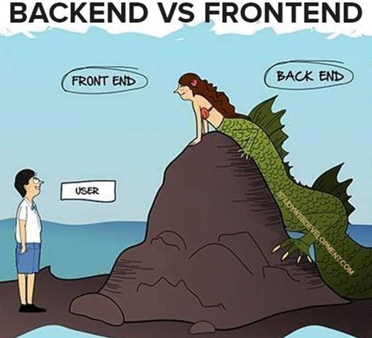

# Backend Course

Source: https://www.pinterest.com/pin/722335227708979491/

## What will you learn?

- Backend definition
- Server-side JavaScript with Node.js
- Web-Applications with Express
- Database with MongoDB

## Backend Definition

- Not visible for users (Frontend is visible for users)
- Server-side part of an application
- APIs (application programming interface)
- Background tasks like scheduler
- Databases

## Example: Restaurant

Usually, the kitchen and stockroom are not visible to the customer. We can compare these rooms with a backend. A user can order food (communicate with the backend), but can not see how it is prepared. The frontend is the decoration, menu-cards and wait-staff.

In this course, we will build a virtual restaurant in multiple steps.

## Tasks

You will find a README.md in every subfolder with instructions and more informations. Please start with `1-node`.
Every task contains tests to verify your learning. These tests are executed from the same folder of this README.md with `npm test`.
You can run specific tasks with `npm test 1-node` or even shorter with `npm test 1`.
